:encoding: ISO-8859-1

Delivery robot
==============
:Author: Paola Lorusso, Walter Mottinelli, Blerta Toska
:Date: 22 Febbraio 2008

Problema
--------
Il problema riguarda la consegna di posta da parte di un robot che si muove in un ambiente costituito da 16 stanze, 4 laboratori e un sistema di corridoi. 

[[piantina]]
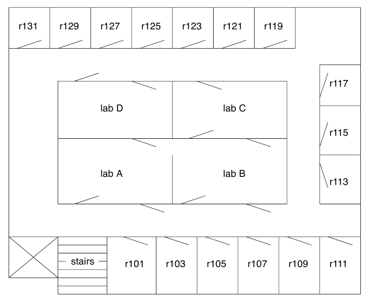

L'ambiente è modellato con un grafo i cui nodi sono i laboratori, le stanze e le posizioni del corridoio davanti a ciascuna stanza.

Il robot è inizialmente posizionato nel laboratorio A con tutta la posta da consegnare a bordo e vi ritorna dopo aver completato il percorso di consegna.

Il problema di ricerca del percorso minore è risolto 

 1. modellando i possibili stati del robot come nodi di un grafo;
 2. modellando i passaggi di stato (cioè le azioni del robot) come archi dello stesso;
 3. eseguendo un algoritmo di ricerca sul grafo degli stati sopra definito.

Stati del robot
---------------
Lo stato del robot è definito in funzione della sua posizione nell'ambiente e della posta a bordo.

.Esempio di stato
******************************
Se il robot si trova nella stanza 101 e deve effettuare consegne nelle stanze 109, 117 e 131, allora la rappresentazione dello stato attuale del robot sarà 
------------------------------
and(in(stanza(101)),[stanza(109),stanza(117),stanza(131)])
------------------------------
******************************

Il robot può cambiare stato in due modi:

 a. spostandosi da una posizione ad un'altra adiacente;

 b. consegnando la posta nella stanza in cui si trova.

I costi associati alle azioni sono determinati 

 a. nel primo caso, dalla distanza tra le due posizioni; 

 b. nel secondo caso, dal costo di consegna prefissato.

.Esempio di azione di spostamento
******************************
Il robot si sposta da una posizione X a una posizione Y adiacente, e la posta a bordo resta inalterata.

In Prolog, lo stato iniziale del robot è definito come
------------------------------
and(in(X),M)
------------------------------
e lo stato finale è definito come
------------------------------
and(in(Y),M)
------------------------------
Nel grafo degli stati del robot, avremo un arco tra i due nodi se e solo se le posizioni X e Y sono adiacenti. Il costo dell'azione di spostamento tra lo stato iniziale e lo stato finale sarà pari al costo di spostamento dalla posizione X alla posizione Y.
******************************

.Esempio di azione di consegna
******************************
Il robot esegue una consegna nella stanza X.

In Prolog, lo stato iniziale del robot è definito come
------------------------------
and(in(X),M)
------------------------------
dove X è anche un elemento di M, e lo stato finale è definito come
------------------------------
and(in(X),N)
------------------------------
Nel grafo degli stati del robot, avremo un arco tra i due nodi se e solo se N è il risultato della sottrazione dell'elemento X dall'insieme M. Il costo dell'azione di consegna sarà pari ad un valore prefissato, nel nostro caso 0.5.
******************************

Approcci di soluzione del problema
----------------------------------
La soluzione al problema di ricerca ha inizio dal predicato +go(\+NumeroStanze: integer, \+Interactive: integer, \+Strategy: integer, \+Stats: integer)+, dove

 * +NumeroStanze+ definisce il numero di stanze in cui consegnare la posta;

 * +Interactive+ è un valore numerico che definisce se il programma chiede interattivamente all'utente lo stato iniziale, e quindi posizione iniziale e posta da consegnare (+Interactive = 1+), oppure se utilizza dei valori preimpostati (+Interactive = 0+). Per comodità, l'esecuzione non interattiva del programma può essere avviata usando il predicato +go/3+ che imposta di default l'argomento +Interactive+ a 0;

 * +Strategy+ definisce la strategia di ricerca, secondo la tabella seguente, in cui +h+ è la funzione euristica e ogni strategia è dettagliata nella sezione linkata.

.descrizione di +Strategy+
.------`-----------------------------------------------------------------------
Valore Strategia
-------------------------------------------------------------------------------
+0+    <<best-first, Best first>>
+1+    <<a_star_1, A* con +h+ su pos>>
+2+    <<a_star_2, A* con +h+ su pos con precalcolo di +h+>>
+3+    <<a_star_3, A* con +h+ su pos e quantità posta a bordo con precalcolo di +h+>>
+4+    <<a_star_4, A* con +h+ su pos e quantità posta a bordo con precalcolo di +h+ e uso di +consult+>>
+5+    <<a_star_5, A* con +h+ su pos e distanza posta a bordo con precalcolo di +h+>>
+6+    <<a_star_6, A* con +h+ su pos e distanza posta a bordo da pos iniziale e allo stato finale con precalcolo di +h+>>
+7+    <<a_star_7, A* con +h+ su pos e distanza posta a bordo da pos iniziale e allo stato finale con precalcolo di +h+ e distanza e uso di nomi di predicato diversi>>
-------------------------------------------------------------------------------

 * +Stats+ definisce la modalità di raccolta delle statistiche:

.descrizione di +Stats+
.------`-----------------------------------------------------------------------
Valore Modalità di raccolta delle statistiche
-------------------------------------------------------------------------------
+0+    nessuna statistica 
+1+    a fine esecuzione, stampa a video il tempo di esecuzione 
+2+    a fine esecuzione, stampa a video la memoria massima utilizzata
+3+    durante l'esecuzione, stampa su file la memoria attualmente utilizzata
-------------------------------------------------------------------------------
 
[[best-first]]
Best-first
~~~~~~~~~~
Impiegando l'algoritmo Best-first, abbiamo osservato che la memoria utilizzata non permetteva di risolvere il problema con più di 4 consegne. Infatti, nel caso con 5 consegne la memoria del global stack usata eccedeva i limiti imposti da SWI-Prolog sul computer a nostra disposizione (33.554.432 bytes).

.spazio di memoria utilizzato da go(5,0,2)
*********************
---------------------
globalused: 117441800
---------------------
*********************

Abbiamo quindi cominciato a pensare a possibile euristiche da utilizzare con A*.

[[a_star_1]]
A* con +h+ su posizione
~~~~~~~~~~~~~~~~~~~~~~~
La prima semplice euristica che abbiamo considerato assegna a ciascun nodo del grafo un valore in funzione della distanza di Manhattan dal goal, senza considerare la posta a bordo.

.Esempio di valore euristico di uno stato
*****************************************
Consideriamo lo stato del robot quando è nella stanza 101 e deve effettuare consegne nelle stanze 109, 117 e 131. Il rispettivo valore euristico +W+ è la distanza di Manhattan della stanza 101 al laboratorio A
----------------------------------------------------------------
h1(in(stanza(101), W) :- distance(in(stanza(101), in(labA)), W).
----------------------------------------------------------------
*****************************************

Abbiamo però osservato che non era computazionalmente efficiente ricalcolare continuamente i valori euristici, ma era più conveniente effettuare un precalcolo iniziale e salvare in memoria i valori ottenuti.

[[a_star_2]]
A* versione 2: precalcoliamo +h+
~~~~~~~~~~~~~~~~~~~~~~~~~~~~~~~~
Abbiamo quindi implementato un meccanismo di precalcolo dei valori euristici. I risultati hanno mostrato un evidente incremento di prestazioni:

.complessità in tempo di go(4,1,1) e go(4,2,1)
********************************
---------------------------------
go(4,1,1)
67,017,632 inferences, 59.07 CPU in 83.46 seconds (71% CPU, 1134546 Lips)

go(4,2,1)
10,609,355 inferences, 14.20 CPU in 16.68 seconds (85% CPU, 747138 Lips)
---------------------------------
Per raffrontare le due strategie in relazione alle altre configurazioni di posta, vedi i grafici riassuntivi relativi al <<inferenze, numero di inferenze>>, al <<tempo-cpu, tempo CPU>> e al <<tempo-totale, tempo totale>>.
*******************************

Calcolare il valore euristico di uno stato senza considerare la posta a bordo assegna però valori euristici uguali a stati che hanno medesime posizioni ma differenti consegne da effettuare, come mostrato nell'esempio seguente.

.Esempio di valore euristico di uno stato
*****************************************
Consideriamo lo stato del robot quando è nella stanza 101 e ha completato tutte le consegne. Il rispettivo valore euristico +W+ è, come nell'esempio precedente, la distanza di Manhattan della stanza 101 al laboratorio A
----------------------------------------------------------------
h1(in(stanza(101), W) :- distance(in(stanza(101), in(labA)), W).
----------------------------------------------------------------
E' evidente però che questo stato dovrebbe avere valore euristico minore rispetto allo stato dell'esempio precedente in quanto il robot, pur trovandosi sempre nella stanza 101, nel primo caso deve ancora consegnare la posta in tre stanze, mentre in questo ha già effettuato tutte le consegne e quindi è più vicino al goal.
*****************************************

[[a_star_3]]
A* versione 3: consideriamo la quantità di posta a bordo
~~~~~~~~~~~~~~~~~~~~~~~~~~~~~~~~~~~~~~~~~~~~~~~~~~~~~~~~
Per risolvere la contraddizione evidenziata negli esempi precedenti, abbiamo considerato una nuova euristica che somma il numero di consegne ancora da effettuare alla distanza dalla posizione attuale allo stato finale.

Abbiamo osservato un miglioramento di prestazioni per quanto riguarda la memoria occupata

.complessità in spazio go(4,2,2) e go(4,3,2)
********************************
------------------------------
go(4,2,2)
globalused: 18704828
localused: 4218272

go(4,3,2)
globalused: 11220888
localused: 2775396
------------------------------
Per raffrontare le due strategie in relazione alle altre configurazioni di posta, vedi i grafici riassuntivi relativi all'uso del <<global-stack, global stack>> e del <<local-stack, local stack>>.
********************************

difatti è stato possibile risolvere anche il problema con 5 consegne

.complessità in spazio go(5,3,2)
********************************
------------------------------
go(5,3,2)
globalused: 25631572
------------------------------
********************************

A fronte di questi miglioramenti, abbiamo osservato un degrado dei tempi di calcolo, probabilmente dovuto alla maggiore complessità della funzione euristica.

.complessità in tempo di go(4,2,1) e go(4,3,1)
********************************
------------------------------
go(4,2,1)
10,609,355 inferences, 14.20 CPU in 16.68 seconds (85% CPU, 747138 Lips)

go(4,3,1)
6,002,966 inferences, 59.56 CPU in 74.87 seconds (80% CPU, 100789 Lips)
------------------------------
Per raffrontare le due strategie in relazione alle altre configurazioni di posta, vedi i grafici riassuntivi relativi al <<inferenze, numero di inferenze>>, al <<tempo-cpu, tempo CPU>> e al <<tempo-totale, tempo totale>>.
********************************

Infatti, mentre la funzione euristica precedente era valutata solo sulle posizioni e non sugli stati completi (ignorando quindi la posta a bordo in ciascuno stato), la nuova euristica viene valutata sugli stati.

L'euristica precedente salva in memoria tanti valori euristici quante sono le posizioni (nel nostro caso, 36), mentre la nuova euristica salva in memoria i valori di ogni stato (nel nostro caso, 36 * 2^+n+ dove +n+ è il numero di consegne del problema).

Poiché i valori euristici vengono salvati in memoria usando uno stesso predicato +valore_h+, al crescere delle asserzioni la ricerca in memoria diventa più complessa come mostrato dal profiler di SWI-Prolog.

.estratto dal profiling di go(4,2,0) e go(4,3,0)
********************************
------------------------------
profile(go(4,2,0))
valore_h/2	18,3%

profile(go(4,3,0))
valore_h/2	88,2%
------------------------------
********************************

[[a_star_4]]
A* versione 4: uso di +consult+
~~~~~~~~~~~~~~~~~~~~~~~~~~~~~~~
Invece di asserire direttamente i valori euristici calcolati, abbiamo provato a salvarli su file e poi successivamente a caricarli con +consult+.
Il vantaggio osservato è stato comunque del tutto trascurabile.

.complessità in tempo di go(4,3,1) e go(4,4,1)
********************************
------------------------------
go(4,3,1)
6,002,966 inferences, 59.56 CPU in 74.87 seconds (80% CPU, 100789 Lips)

go(4,4,1)
6,169,613 inferences, 61.98 CPU in 75.14 seconds (82% CPU, 99542 Lips)
------------------------------
Per raffrontare le due strategie in relazione alle altre configurazioni di posta, vedi i grafici riassuntivi relativi al <<inferenze, numero di inferenze>>, al <<tempo-cpu, tempo CPU>> e al <<tempo-totale, tempo totale>>.
********************************

.complessità in spazio di go(4,3,2) e go(4,4,2)
********************************
------------------------------
go(4,3,2)
globalused: 11220888
localused: 2775396

go(4,4,2)
globalused: 10358912
localused: 2775396
------------------------------
Per raffrontare le due strategie in relazione alle altre configurazioni di posta, vedi i grafici riassuntivi relativi all'uso del <<global-stack, global stack>> e del <<local-stack, local stack>>.
********************************

[[a_star_5]]
A* versione 5: consideriamo la distanza delle future consegne dalla posizione attuale
~~~~~~~~~~~~~~~~~~~~~~~~~~~~~~~~~~~~~~~~~~~~~~~~~~~~~~~~~~~~~~~~~~~~~~~~~~~~~~~~~~~~~
Per migliorare l'euristica precedente, abbiamo considerato anche la qualità della posta a bordo, stimata calcolando la somma delle distanze dalla posizione attuale alle stanze in cui il robot deve ancora consegnare e dividendo il risultato per il numero di consegne complessive del problema.

In questo modo, abbiamo osservato un miglioramento delle prestazioni sia in tempo che in spazio:

.complessità in tempo di go(4,3,1) e go(4,5,1)
********************************
------------------------------
go(4,3,1)
6,002,966 inferences, 59.56 CPU in 74.87 seconds (80% CPU, 100789 Lips)

go(4,5,1)
5,316,281 inferences, 50.21 CPU in 63.55 seconds (79% CPU, 105881 Lips)
------------------------------
Per raffrontare le due strategie in relazione alle altre configurazioni di posta, vedi i grafici riassuntivi relativi al <<inferenze, numero di inferenze>>, al <<tempo-cpu, tempo CPU>> e al <<tempo-totale, tempo totale>>.
********************************

.complessità in spazio di go(4,3,2) e go(4,5,2)
********************************
------------------------------
go(4,3,2)
globalused: 11220888
localused: 2775396

go(4,5,2)
globalused: 8736084
localused: 2332156
------------------------------
Per raffrontare le due strategie in relazione alle altre configurazioni di posta, vedi i grafici riassuntivi relativi all'uso del <<global-stack, global stack>> e del <<local-stack, local stack>>.
********************************

[[a_star_6]]
A* versione 6: consideriamo anche la distanza delle future consegne dal goal
~~~~~~~~~~~~~~~~~~~~~~~~~~~~~~~~~~~~~~~~~~~~~~~~~~~~~~~~~~~~~~~~~~~~~~~~~~~~
Sulla base delle riflessioni che ci hanno portato a definire l'euristica precedente, abbiamo deciso di realizzarne una nuova che tenesse in considerazione

 * la stima delle distanze dalla posizione attuale alle stanze in cui il robot deve ancora consegnare;

 * la stima delle distanze dalle stanze in cui il robot deve ancora consegnare al goal.

In questo modo, però, gli stati in cui il robot ha già consegnato tutta la posta avrebbero avuto valore 0. Conseguentemente, abbiamo aggiunto alle due stime precedenti anche la distanza dalla posizione attuale al goal, divisa per 100 in modo che non influenzasse eccessivamente l'euristica.

I risultati ottenuti erano comunque complessivamente inferiori rispetto all'euristica precedente.

.complessità in tempo di go(4,5,1) e go(4,6,1)
********************************
------------------------------
go(4,5,1)
5,316,281 inferences, 50.21 CPU in 63.55 seconds (79% CPU, 105881 Lips)

go(4,6,1)
7,446,317 inferences, 76.65 CPU in 90.25 seconds (85% CPU, 97147 Lips)
------------------------------
Per raffrontare le due strategie in relazione alle altre configurazioni di posta, vedi i grafici riassuntivi relativi al <<inferenze, numero di inferenze>>, al <<tempo-cpu, tempo CPU>> e al <<tempo-totale, tempo totale>>.
********************************

.complessità in spazio di go(4,5,2) e go(4,6,2)
********************************
------------------------------
go(4,5,2)
globalused: 8736084
localused: 2332156

go(4,6,2)
globalused: 12003664
localused: 3089012
------------------------------
Per raffrontare le due strategie in relazione alle altre configurazioni di posta, vedi i grafici riassuntivi relativi all'uso del <<global-stack, global stack>> e del <<local-stack, local stack>>.
********************************

Eseguendo il profiling, abbiamo osservato che era elevato il tempo passato dall'interprete nella valutazione del predicato +valore_h+, che preleva dalla memoria i valori euristici precalcolati.

.estratto dal profiling di go(4,6,0)
********************************
------------------------------
profile(go(4,6,0))
valore_h/2	88,7%
------------------------------
********************************

Quindi abbiamo cercato di ottimizzare ulteriormente l'euristica facendo sì che il precalcolo dei valori euristici asserisse predicati di nome diversi.

[[a_star_7]]
A* versione 7: precalcoliamo la distanza e asseriamo i valori di h usando predicati con nomi diversi
~~~~~~~~~~~~~~~~~~~~~~~~~~~~~~~~~~~~~~~~~~~~~~~~~~~~~~~~~~~~~~~~~~~~~~~~~~~~~~~~~~~~~~~~~~~~~~~~~~~~
Perché l'indicizzazione automatica di Prolog sui nomi dei predicati fosse più efficace, abbiamo memorizzato i valori euristici in predicati aventi come nome una semplice rinomina della posizione.

.Esempio di asserzione di un predicato con nome diverso
******************************
Nell'euristica precedente, il valore W dello stato del robot che si trova nella stanza 101 e deve effettuare consegne nelle stanze 109, 117 e 131, veniva asserito in questo modo:
------------------------------
valore_h(and(in(stanza(101)),[stanza(109),stanza(117),stanza(131)]), W).
------------------------------

Nella nuova euristica, il valore W dello stesso stato viene asserito in questo modo:
------------------------------
s101([stanza(109),stanza(117),stanza(131)], W).
------------------------------
dove +s101+ è la rinomina di +stanza(101)+.
******************************

Le statistiche raccolte confermano i miglioramenti previsti in tempo

.complessità in tempo di go(4,6,1) e go(4,7,1)
********************************
------------------------------
go(4,6,1)
7,446,317 inferences, 76.65 CPU in 90.25 seconds (85% CPU, 97147 Lips)

go(4,7,1)
12,722,218 inferences, 17.64 CPU in 19.91 seconds (89% CPU, 721214 Lips)
------------------------------
Per raffrontare le due strategie in relazione alle altre configurazioni di posta, vedi i grafici riassuntivi relativi al <<inferenze, numero di inferenze>>, al <<tempo-cpu, tempo CPU>> e al <<tempo-totale, tempo totale>>.
********************************

pur con un accettabile degrado delle prestazioni in spazio.

.complessità in spazio di go(4,6,2) e go(4,7,2)
********************************
------------------------------
go(4,6,2)
globalused: 12003664
localused: 3089012

go(4,7,2)
globalused: 14002996
localused: 3089012
------------------------------
Per raffrontare le due strategie in relazione alle altre configurazioni di posta, vedi i grafici riassuntivi relativi all'uso del <<global-stack, global stack>> e del <<local-stack, local stack>>.
********************************

Grafici riassuntivi
-------------------

Pubblichiamo i grafici delle statistiche raccolte che differenziano i risultati trovati per ciascun algoritmo impiegato nel calcolo, in funzione del numero di consegne.

[[tempo-cpu]]
Tempo CPU
~~~~~~~~~
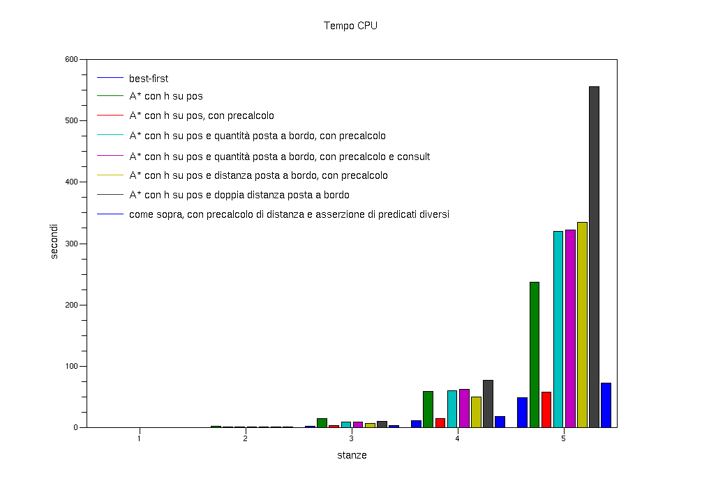

Si osserva in particolare come il precalcolo riduce drasticamente i tempi di esecuzione, ad esempio nel confronto tra la prima e la seconda versione di A*.

[[tempo-totale]]
Tempo totale
~~~~~~~~~~~~
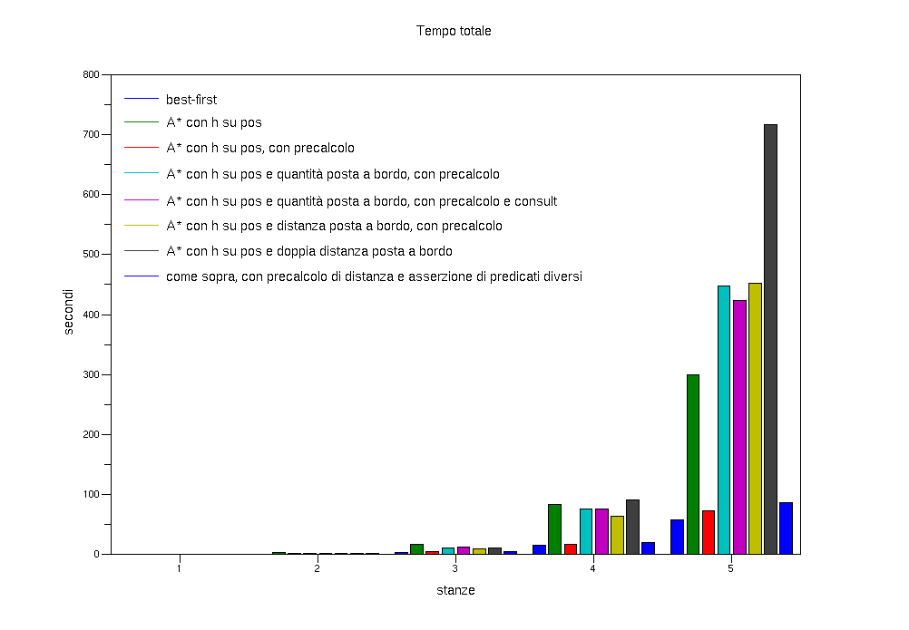

[[inferenze]]
Numero di inferenze
~~~~~~~~~~~~~~~~~~~
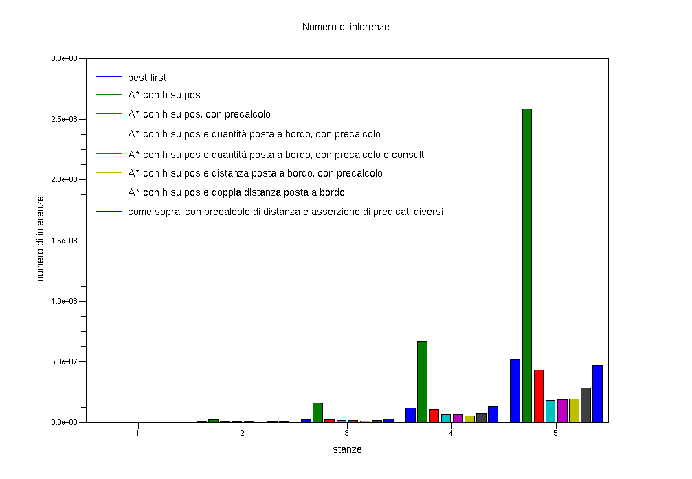

Oltre ai vantaggi evidenti del precalcolo, si osserva come euristiche più complesse richiedano un maggior numero di inferenze.

[[global-stack]]
Utilizzo del global stack
~~~~~~~~~~~~~~~~~~~~~~~~~
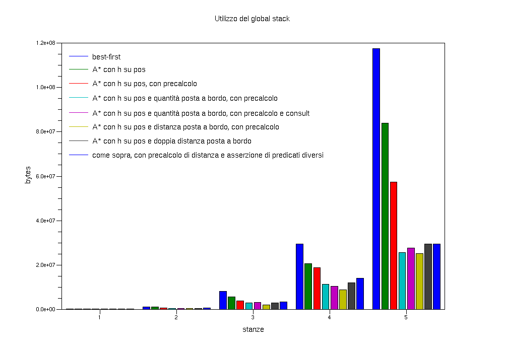

Si nota come euristiche più raffinate permettano di ridurre l'utilizzo del global stack, in quanto "guidano" in modo migliore l'algoritmo di ricerca.

[[local-stack]]
Utilizzo del local stack
~~~~~~~~~~~~~~~~~~~~~~~~
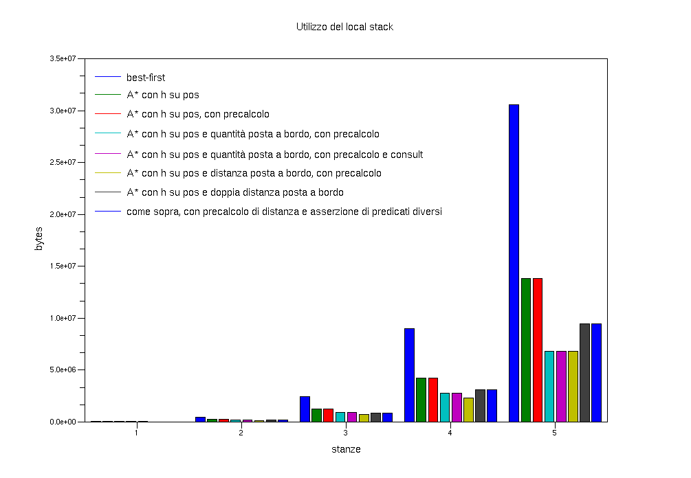

Numero di bytes in uso nel global stack
~~~~~~~~~~~~~~~~~~~~~~~~~~~~~~~~~~~~~~~
Infine, è possibile registrare in fase di esecuzione l'utilizzo della memoria impostando l'argomento +Stats+ di +go/3+ o +go/4+ al valore 3. 

La raccolta dei dati avviene in corrispondenza dell'inserimento di un nodo in frontiera.

Riportiamo a titolo di esempio il grafico ottenuto dai dati raccolti con il comando +go(4,0,3)+.

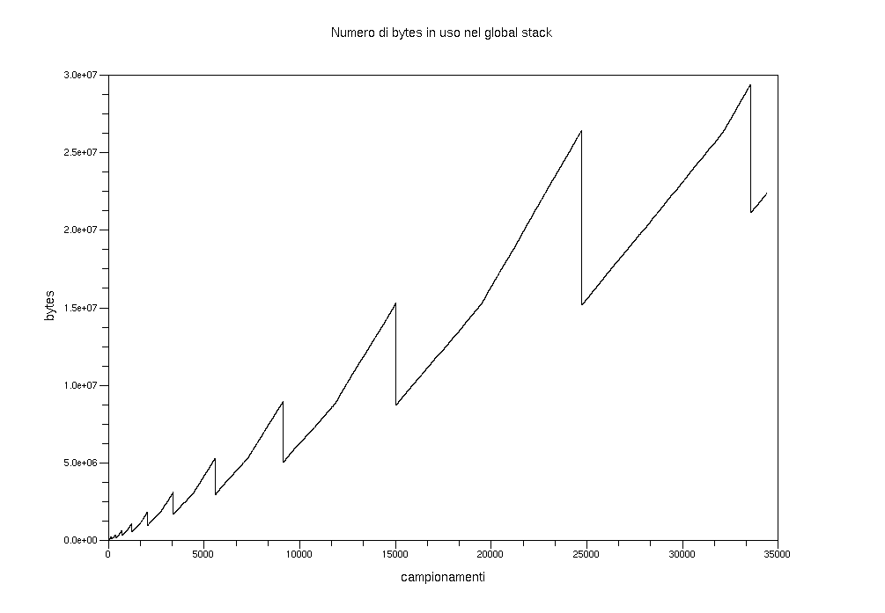

L'approccio _divide et impera_
------------------------------

E' possibile usare un approccio del tipo _divide et impera_ per risolvere efficientemente il problema.

Invece di applicare Best-first o A* sul grafo di tutti i possibili stati del robot, è conveniente applicarli più volte su istanze ridotte del problema.

Definiamo con il termine di *grafo complessivo* il grafo che ha come nodi tutti i possibili stati del robot e come archi le coppie di nodi rappresentanti stati collegati da un'azione di spostamento o di consegna.

Definiamo invece con il termine di *grafo ridotto* il grafo che ha come nodi i soli stati di particolare interesse del robot (ovvero lo stato iniziale, quello finale e gli stati in cui esegue una consegna). Gli archi del grafo ridotto sono invece le coppie di nodi per cui vale la relazione

--------------------
and(in(X),[s_1, s_2, ..., s_i, ..., s_n]) ---> and(in(s_i),[s_1, s_2, ..., s_i-1, s_i+1, ..., s_n])
--------------------

Si osserva che gli archi del grafo ridotto corrispondono a cammini sul grafo complessivo.

.Esempio di grafo ridotto
**********************************************************
Il grafo che segue è il grafo ridotto del problema che ha come posizione iniziale e finale il laboratorio A, e consegne nelle stanze 109, 117 e 131.

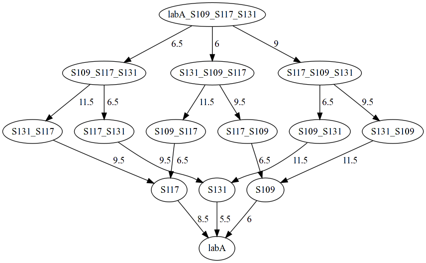

L'etichetta di un nodo ha come primo elemento la posizione attuale, seguito dalle stanze in cui deve ancora essere effettuata la consegna,
******************************

E' possibile quindi calcolare i costi degli archi del grafo ridotto impiegando un algoritmo di ricerca sul grafo complessivo, definendo opportunamente lo stato iniziale e finale.

.Esempio di calcolo del costo di un arco del grafo ridotto
**********************************************************
Per calcolare il costo dell'arco dallo stato +and(in(labA), [stanza(109),stanza(117),stanza(131)])+ allo stato +and(in(stanza(131)), [stanza(109),stanza(117)])+, posso ridefinire il primo stato come stato iniziale e il secondo come stato finale
------------------------------
assert( stato_iniziale(and(in(labA), [stanza(109),stanza(117),stanza(131)])) ).
assert( trovato(and(in(stanza(109)), [stanza(117),stanza(131)])) ).
------------------------------
Posso quindi avviare l'algoritmo di ricerca (in questo caso, Best-first) sul grafo completo
------------------------------
go(3,0,0)
------------------------------
e ottenere in risposta il cammino tra i due stati e il suo costo.
******************************

Una volta definiti i costi di tutti gli archi del grafo ridotto, è possibile applicare un algoritmo di ricerca al grafo ridotto. Ogni arco del cammino più breve sul grafo ridotto può quindi essere espanso con i cammini risultato delle prime esecuzioni dell'algoritmo di ricerca sul grafo completo, componendo in questo modo il percorso completo dallo stato iniziale allo stato finale del problema.

.Esempio di espansione di un arco del grafo ridotto
**********************************************************

Il cammino che segue è l'espansione dell'arco del grafo ridotto che congiunge lo stato +and(in(labA),[stanza(109),stanza(117),stanza(131)])+ allo stato +and(in(stanza(131)),[stanza(109),stanza(117)])+.

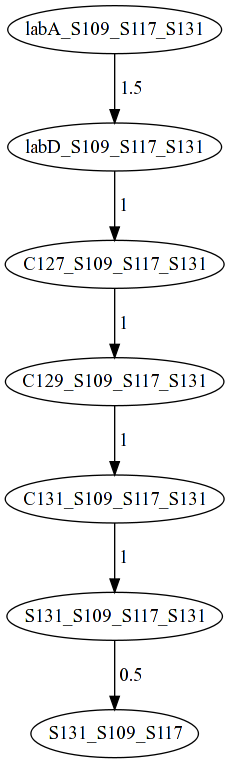

******************************

Poiché l'algoritmo di ricerca lavora su un sottografo del grafo complessivo, se ne trae vantaggio in termini sia di tempo che di memoria.

A riprova, abbiamo implementato l'approccio _divide et impera_ con il comando +dei(\+NumeroStanze: integer, \+Strategy: integer, \+Stats: integer)+ (per la descrizione dei parametri, fare riferimento a +go/3+). Abbiamo quindi eseguito delle prove utilizzando l'algoritmo Best-first per il calcolo dei cammini, ed infine abbiamo messo a confronto i risultati ottenuti con le migliori statistiche degli algoritmi precedenti:

Tempo CPU
~~~~~~~~~

Tempo totale
~~~~~~~~~~~~
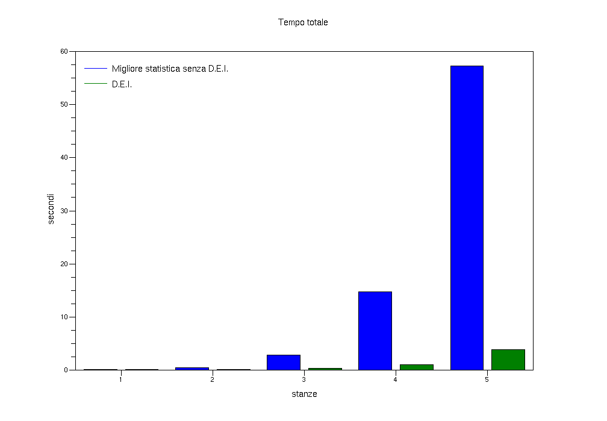

Numero di inferenze
~~~~~~~~~~~~~~~~~~~
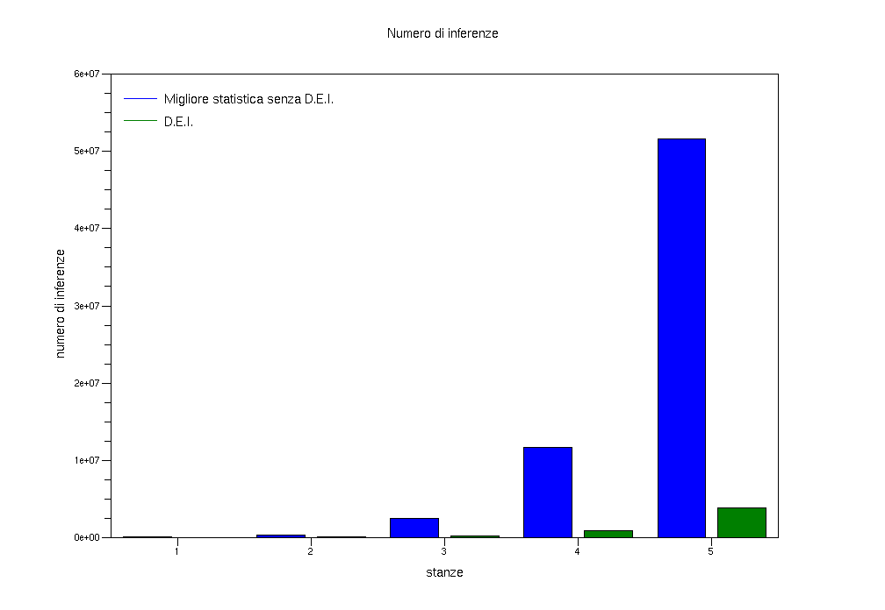

Utilizzo del global stack
~~~~~~~~~~~~~~~~~~~~~~~~~
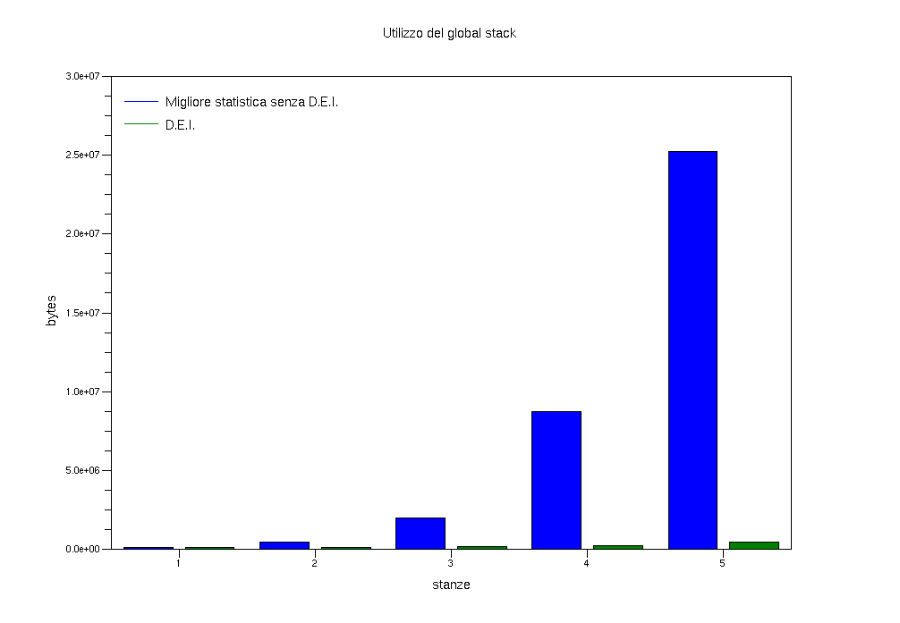

Grazie al risparmio di memoria, con questa soluzione siamo riusciti a risolvere il problema di 8 consegne senza ampliare la dimensione predefinita del global stack.

Utilizzo del local stack
~~~~~~~~~~~~~~~~~~~~~~~~
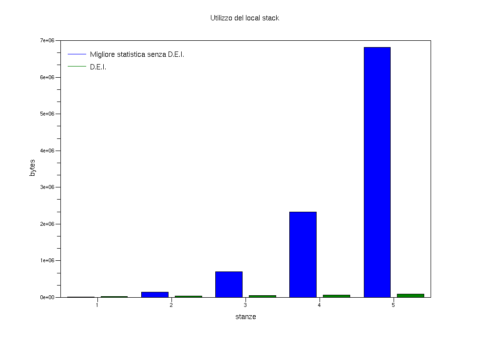

Possibili miglioramenti
-----------------------
Sia per l'approccio tradizionale che per l'approccio _divide et impera_, è possibile migliorare ulteriormente le prestazioni implementando euristiche che considerino il numero di consegne effettuate lungo ogni cammino. In questo modo, è possibile ridurre ulteriormente la dimensione del grafo su cui applicare l'algoritmo di ricerca.

Ad esempio, si potrebbe valutare la bontà di un cammino dallo stato iniziale a ciascuna stanza in funzione delle possibilità di consegne lungo quel cammino.

.Esempio di ordinamento dei cammini secondo il numero di consegne intermedie
****************************************************************************
Si consideri l'ambiente raffigurato nella <<piantina, piantina>>.

Poniamo di essere nel laboratorio A, di dover consegnare nelle stanze 105, 109 e 113 e di avere in memoria i cammini per ciascuna consegna. 

Si osserva che il cammino dal laboratorio A alla stanza 109 permette la consegna anche nella stanza 105,  mentre il cammino dal laboratorio A alla stanza 113 permette un'ulteriore consegna nella stanza 109. 

Sulla base del numero di consegne intermedie, l'euristica andrà a privilegiare il cammino che porta in stanza 113.
****************************************************************************

Appendix A: Files del progetto
------------------------------

`-----------------------`-----------------------------------------------------------------
Nome file		Descrizione
------------------------------------------------------------------------------------------
a_star.pl		definisce la relazione di ordinamento che caratterizza A*
best_first.pl		definisce la relazione di ordinamento che caratterizza Best-first
cerca.pl		implementa l'algoritmo di ricerca
cerca2.pl		implementa l'algoritmo di ricerca (variante per D.E.I.)
dei.pl			implementa l'approccio D.E.I. al problema del delivery robot
delivery.pl		implementa l'approccio tradizionale al problema del delivery robot
distance.pl		implementa la distanza di Manhattan
euristica.pl		definisce le possibili euristiche di A*
frontiera_ordinata.pl	implementa la frontiera ordinata come coda di priorità
init.pl			contiene il codice di inizializzazione del programma
stats.pl		contiene il codice che implementa i contatori
world.pl		contiene il modello dell'ambiente
------------------------------------------------------------------------------------------

Appendix B: Requisiti di sistema
--------------------------------

Il progetto richiede i seguenti software (vengono indicate anche le versioni testate):

`----------`--------`----------`----------------------------
Software   Versione Importanza URL          
------------------------------------------------------------
SWI-Prolog 5.6.50   necessario http://www.swi-prolog.org[http://www.swi-prolog.org]
------------------------------------------------------------
